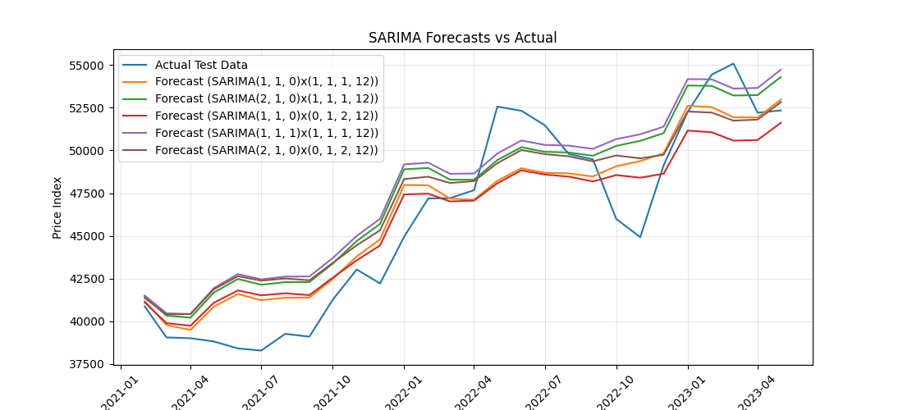
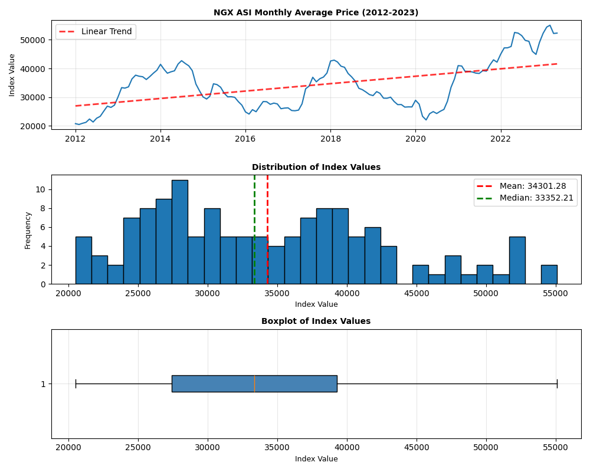
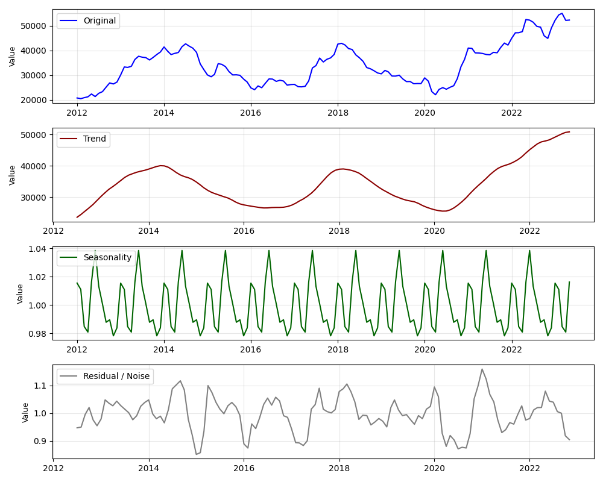
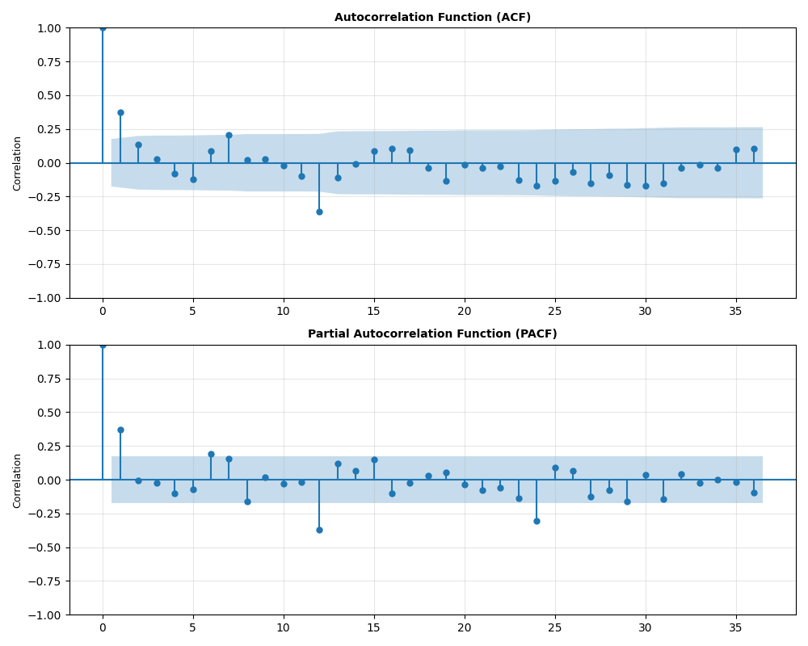

# TS_Academy_Capstone_Project

## Time Series Analysis and Forecasting of the NGX All Share Index



This project focuses on analyzing and forecasting the Nigerian Stock Exchange All Share Index (NGX ASI) using time series analysis techniques. The goal of the project is to understand the historical movement of the index, identify important patterns in the data, and develop a forecasting model that can reasonably predict future market movement.

The dataset contains monthly observations of the NGX ASI average price index from 2012 to 2023. Because the data is time based, the analysis followed a proper time series workflow starting from data preparation and visualization to stationarity testing, model building, forecasting, and evaluation.

The project began with data inspection and preprocessing. The date column was converted into datetime format and used as the index so the dataset could be treated as a proper time series. This made it possible to perform operations such as resampling, differencing, and seasonal decomposition.

Exploratory analysis showed that the market index had a strong long term upward trend, although there were visible periods of decline and correction along the way. These movements reflect how the market changed across the years and gave a good foundation for forecasting.



To better understand the structure of the series, seasonal decomposition was carried out. This helped separate the trend, seasonal, and residual components of the data. The decomposition showed that the series had a clear trend and some seasonal movement, which justified moving beyond a simple non seasonal forecasting model.



The next stage involved testing the stationarity of the series. Since time series models like ARIMA and SARIMA work best with stationary data, the series was differenced and tested. Autocorrelation and partial autocorrelation plots were then used to guide parameter selection for the forecasting models.



An ARIMA model was first tested as a baseline approach, but its forecasts were not satisfactory. The predictions were too flat and did not capture the actual movement of the index very well. This made it clear that the data had seasonal behavior that the ARIMA model could not fully account for.

A SARIMA model was then built to include both trend and seasonal components. Different parameter combinations were explored and compared using model performance measures. The final selected model produced a Mean Absolute Percentage Error of about 3.96 percent, showing that the forecasting performance was strong for this dataset.

The forecast plot below shows the relationship between the predicted values and the actual movement of the NGX ASI index.


Overall, this project demonstrates a complete time series analysis workflow using a Nigerian financial market dataset. It shows how forecasting models can be applied to real market data to generate useful insights and future estimates.

Technologies used in this project include Python, Pandas, NumPy, Matplotlib, Seaborn, Statsmodels, and Scikit learn.

# Project structure

```
TS_Academy_Capstone_Project
│
├── Raw Data
│   └── Major indices in the Nigeria Capital Markets.csv
│
├── Data
│   └── ngx_asi_index_price_data.csv
│
├── Images
│   ├── asi_price_trend.png
│   ├── seasonal_decomposition.png
│   ├── acf_pacf_diff.png
│   └── sarima_forecast_vs_actual.png
│
├── Notebook
│   └── group8_tsa_cp.ipynb
│
└── README.md
```

The Raw Data folder contains the original dataset collected for the project.

The Data folder contains the cleaned dataset used for the time series analysis.

The Images folder contains the plots generated during the analysis and used in this README.

The Notebook folder contains the full Jupyter notebook where the analysis, modeling, and forecasting were carried out.

## Challenges Encountered and Lessons Learned

One of the first challenges faced in this project was getting a suitable dataset. The group explored about five different datasets before settling on the one used in this project. Some of the earlier datasets were incomplete, while others did not have enough observations or consistency for proper time series analysis. The NGX ASI dataset was eventually selected because it was more complete and better suited to the project objective.

Another challenge was communication among group members. Most of the coordination happened through the group WhatsApp platform, but only a few members actively contributed to discussions and progress. This affected the speed of collaboration and meant that some members had to carry more of the work than others.

The next major challenge came during the modeling stage. The first machine learning approach used for forecasting did not perform well enough, and the initial ARIMA results were also weak because the forecasts appeared almost like straight lines. This showed that the model was not capturing the structure of the series properly. After further testing and adjustments, the SARIMA model turned out to be a much better fit for the dataset because it could account for the seasonal nature of the series.

These challenges helped improve our understanding of dataset selection, teamwork in collaborative projects, and the importance of choosing the right model for the right kind of data.

# TS Academy Capstone Project
